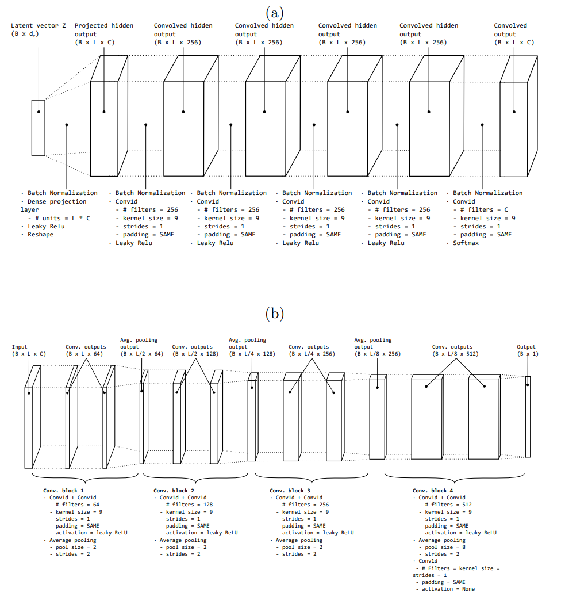

# An empirical study about the use of Generative Adversarial Networks for text generation
This repository contains all the code I used to build my [MSc thesis](./TFM - Iván Vallés Pérez.pdf). You can find a very detailed documentation in the pdf containing the thesis. Each of the experiments (>30) performed in the master's thesis has been organised in a different branch of the repository; for understanding each of the experiments, please, read the **Appendix A** of the document.

## Introduction and objectives

GAN (Generative Adversarial Networks) define a new research line in the generative modelling field. This new paradigm showed impressive results in the computer vision field when they were applied to generate new images from a real data set. Some studies reported results whose generations are clearly indistinguishable from real images to the human eye.

Despite that, they have not been broadly applied to generate discrete sequences (e.g. text). One of the most reported issues when generating text using generative adversarial networks is the difficulty that they have of dealing with discrete generations which, indeed, is the nature of text.

The goal of this project is to study how GANs can be applied to generate free text and which are the advantages and disadvantages over other common approaches. The best results obtained have been properly reported and quantified.

The main objective of this work is to exhaust all the possibilities when trying to generate text using Generative Adversarial Networks, avoiding using non-gradient-based optimization methods typically used in reinforcement learning. The reasons why non gradient-based optimization methods are non-desirable are described below.
- Generative Adversarial Networks are a very recent family of algorithms which showed in several studies a high probability of diverging [8, 9].
- Reinforcement learning training algorithms are much more complex because they do not have information about the direction of the gradients; i.e. it is more difficult to estimate the changes to be done to the parameters of the network in order to decrease the error.
- The fact of not using a gradient-based approach is a good chance to check how powerful are the neural networks. To succeed, they will have to approximate a sampling over a the probability distribution of the next character of a sequence of text given the previous one.


## Data
After an exhaustive research **Tatoeba corpus** was found. Tatoeba is a large open-source and free collection of sentences written in multiple languages which is intended to be a powerful resource for natural language processing tasks. It is specially focused on machine translation tasks. The sentences contained in this corpus have been included by the community of registered users and they have an impressive quality. A sample of english sentences extracted from this collection is included below as an example.
```
Is it cruel to declaw your cat?
I learned English words by heart all day yesterday.
I knew that someone would come.
Any gentleman would not use such language.
Mary is still living with her parents.
The eastern sky was getting light.
You are weak.
I very seldom eat lobster.
Those are the leftovers from lunch.
Do you like your new apartment?
It took him three tries.
Tom walked into his room.
```

This dataset, after a set of preprocessing and filtering steps, has been used along all the experiments.

## Methods
Several architectures and techniques have been tested to arrive to the final solution. All these experiments can be found in the thesis (linked at the top of this README. The winning solution consisted of convolutional neural networks implemented in both, the *generator* and the *critic*. The following figure sketches the architecture used in this solution, where (a) represents the generator and (b) represents the discriminator architectures. 



This implementation can be found in the branch labeled as **V20**.


## Results
The results are described very in detail in the thesis. Here, a set of sentences generated using the *Generative Adversarial Network* model designed are summarized.

```
Tom and Mary wasn’t to do you do here.
Are you going to take.
Tom needed to do?
Tom and Mary doesn’t do that.
We have to leave.
Mary should have to want to win?
Tom doesn’t know.
I’d like to.
I know what you said you want.
Are you.
I like to help you?
I’m going to be.
You didn’t want them.
I thought you didn’t do that.
We don’t want me.
Tom didn’t like anything.
Tom and Mary wanted to do that.
Tom wasn’t here?
I got him.
Tom is going to do that the time.
Mary didn’t want to help.
I need to do that?
Why are you and you have?
I’d like that.
It’s not you.
That’s the last meeting.
I don’t want to tell Tom and Mary like it.
How did you need to go.
I need Tom.
I need to help Mary.
```

## Conclusion
The results shown in section 5.3 of the thesis show that the Generative Adversarial Networks are able to generate text. However, the optimal models have taken a long time to train and no impressive results have been achieved. Apart from this, early trials with noisier datasets (twitter ) showed that the model performance in text generation tasks highly depends on the quality of the data. Compared to other tasks like image and audio generation, in which these models showed very impressive results, GANs seem not to be the generative model which best suits for text generation. Ian Goodfellow stated that GAN models usually struggle with discrete data generation and proposed using algorithms to train them which do not require gradient computations nor differentiability of the model function: for example the reinforce algorithm or other typical algorithms broadly known in the reinforcement learning field. Still, it can be concluded that the GAN algorithms should not be the choice when a text generation task arises. From the architectures tested during this work, a set of take away conclusions have been compiled and described below. Not all these conclusions were expected, but they are result of the experimentation.

- Reducing the noise signal of the minibatches is highly recommended. It can be done by increasing their size, so that differences between the gradients from one minibatch to another are minimized. It showed a meaningful improvement in the final performance of the experiments conducted during this project.

- The convolutional neural networks filter size showed to be a crucial parameter to tune in the performance-stability trade off. Large convolutions yielded better results while making the whole system more prone to diverge and vice-versa. Optimal convolution sizes ranged from 9 to 11. A possible explaination of this may be the fact that the convolution sizes control the complexity of the model. Large complexities tend to produce overfitting while small ones lead to underfitting.

- Increasing the number of recurrent cells in the recurrent modules substantially improved the quality of the generations. This may happen because the more number of cells a network has, the more predicting power and memory is it provided with. In this case, large amounts of memory are required in order to make the model able to correctly model the complex structures of the language.

The results can be generalized to all kinds of Generative Adversarial Networks adjusted with gradient based optimization methods, because even having achieved very stable models (at least with both CNN and RNN architectures), the resulting models do not show very good results in comparison to other methods (char-rnn for instance). In the research and development of this work, some GAN versions trained using reinforcement learning algorithms and showing good results have appeared in the bibliography. Still, other models like variational
autoencoders perform well without such a complex setting.

Nevertheless, a potential production-ready application for the architectures developed in this work could be a keyword generation system for specific domains. As they represent short pieces of text which may not be gramatically correct, the approaches described in this work could perform well. A good example could be generating novel keywords for increasing the variability of them in online marketing campaigns. In this field, vast amounts of keywords are used in order to try to cover a whole field maximizing the market share. This task is typically done manually, with the help of some automation tools. These algorithms could ingest a big amount of existing keywords and generate new ones, strongly related with the existing ones, but different.


## Further work
A set of next steps has been identified in order to provide the reader with
ideas on how to continue this research line, in case he/she is interested. These
ideas have been collected during the research and development of this work, and
only those which have been partially tested or even not tested (and seem to be
promising to the intuition of the author) have been included here.

- The use of a recurrent neural network in the discriminator seems to be very appropriate due to the sequential nature of text. However, it would require the model not to apply the gradient penalty in the GAN loss function; because it implies a second derivative to be calculated. As explained in section 4, there is a technical limitation in the main frameworks when performing this task. That is why it could be a good idea to start from the WGAN definition and try to improve the way it enforces the Lipschitz constraint avoiding using second-order derivatives calculations. A good example of this effort is the SLOGAN [89] definition but it did not perform well in practice. That is why a soft version of the weight clipping is proposed. Instead of clipping the weights of the network cutting the extreme values to fit in a given range, the following function could be used: $W \gets c \cdot tanh(W)$
- The Gumbel softmax seems to be a promising way of turning the sampling operation into a differentiable function, which would be useful for using a recurrent neural network in the discriminator while applying a gradient penalty in the loss function. It has been tested in this work and it did not produced good results, but further tests should be done in order to fully discard this alternative. 
- Reinforcement learning optimization algorithms can be a good way of overcoming the problem, because it removes the differentiability constraint in the network and fully visible belief networks could be used.
- The algorithms proposed in this work should be tested using much shorter texts, such as keywords. The hypothesis in this scenario is that the recurrent neural network would produce dramatically better results because the error which is propagated in the pseudo-sampling operation that the network is currently forced to do would decrease with the length of the sentences generated. This error must grow exponentially with the size of the generated sentence.
- Developing compatibility with second-order derivarives in the general frameworks (Tensorflow and Pytorch) would be extremely useful for this study, allowing us building sequential discriminators.
- Using skip-gram precision as additional evaluation metric must be desirable. It consists of calculating non-contiguous words matching proportions between the generated samples and the real dataset. It would enormously help quantifying the global syntax correctness of the generated sentences

## Getting started
In order to reproduce the experiments discussend here, please, follow the subsequent steps
1. Create a `settings.json` config file in the root of this repository following the structure of the `settings_template.json` file
2. Install the following libraries
    - tensorflow
    - pytorch
    - pandas
    - numpy
    - nltk
    - tensorboard
    
3. Download the **tatoeba** dataset from the official website and drop the *tsv* file into a folder named as *input*
4. Choose the branch corresponding to the experiment you are interested to reproduce
5. Open an `ipython` console from the root of the repository and run the following command `%run src/main.py`
6. Check the performance evolution in tensorboard 

## Contribution
The repository is totally open for contribution. As this is a log of a set of experiments, the contributions should be done so that they do not destroy the current branches. New trials should be performed in new branches, but bug fixes are also totally accepted.

## License
...